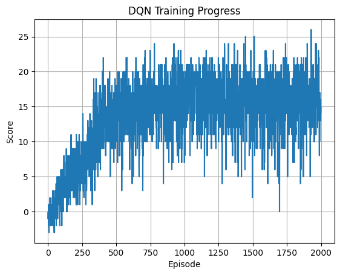

# 📄 Report.md – Navigation Project (Udacity DRL Nanodegree)

## 📌 1. Project Overview

In this project, we developed a reinforcement learning agent using Deep Q-Learning (DQN) to solve a Unity-based environment where the goal is to collect yellow bananas while avoiding blue ones.

- 🟡 +1 reward for collecting a yellow banana
- 🔵 -1 penalty for collecting a blue banana

The environment is **considered solved** when the agent achieves an **average score of +13 over 100 consecutive episodes**.

---

## 🧠 2. Learning Algorithm: Deep Q-Network (DQN)

We implemented a standard **Deep Q-Network (DQN)** algorithm with the following core elements:

### 🔧 Techniques Used

- **Epsilon-Greedy Policy** for exploration vs. exploitation
- **Experience Replay Buffer**
- **Fixed Q-Targets**
- **Soft Update** of the target network (with parameter `tau = 1e-3`)

### 🔢 Hyperparameters

| Parameter        | Value         |
| ---------------- | ------------- |
| Buffer size      | 100,000       |
| Batch size       | 64            |
| Gamma (discount) | 0.99          |
| Learning rate    | 5e-4          |
| Tau              | 1e-3          |
| Update frequency | Every 4 steps |
| Epsilon start    | 1.0           |
| Epsilon min      | 0.01          |
| Epsilon decay    | 0.995         |

### 🧩 Neural Network Architecture

Defined in `model.py`:

- Input: 37-dimensional state
- Hidden layers: 64 → 64 neurons (ReLU activations)
- Output: 4 actions (Q-values for each possible action)

```python
self.fc1 = nn.Linear(state_size, 64)
self.fc2 = nn.Linear(64, 64)
self.fc3 = nn.Linear(64, action_size)
```

---

## 📈 3. Performance

The agent successfully solved the environment by episode **500**, achieving an average score over 100 episodes of **13.47**. It continued to improve over the next 1500 episodes:

| Episode | Average Score |
| ------- | ------------- |
| 100     | 0.94          |
| 200     | 4.60          |
| 300     | 6.71          |
| 400     | 10.99         |
| 500     | **13.47** ✅   |
| 1000    | 15.42         |
| 1500    | 15.76         |
| 2000    | 16.25         |

### 📊 Training Progress



The score increased steadily and stabilized above the threshold of 13.

---

## 📁 4. Files Included

| File               | Description                        |
| ------------------ | ---------------------------------- |
| `model.py`         | QNetwork neural network definition |
| `dqn_agent.py`     | Agent and Replay Buffer classes    |
| `Navigation.ipynb` | Training and evaluation script     |
| `checkpoint.pth`   | Trained weights of the agent       |
| `report_navigation.md`        | This report                        |
| `README.md`        | Setup instructions and overview    |

## 🔭 5. Future Work

To further improve the agent’s performance and stability, we could implement:

- **Double DQN** – to reduce overestimation bias of Q-values
- **Dueling DQN** – to separate value and advantage streams, improving learning efficiency
- **Prioritized Experience Replay** – to replay more informative experiences more frequently
- **Noisy Networks** – for improved exploration without relying solely on epsilon-greedy strategies
- **Rainbow DQN** – combining multiple extensions such as Double DQN, Dueling, PER, and Noisy Nets
- **Multi-Agent Training** – to increase sample diversity and generalization
- **Pixel-Based Learning** – switching from vector states to raw image inputs for more realistic environments

### 🔧 Enhancements to Current Model

In addition to advanced techniques, the following improvements could be made to the existing model:

- **Hyperparameter tuning**:
  - Adjust learning rate (`LR`) to better balance speed and stability
  - Experiment with different `batch_size`, `buffer_size`, or `tau` values
- **Network Architecture**:
  - Add a third hidden layer or increase neuron count to capture more complex patterns
  - Test alternative activation functions (e.g., `LeakyReLU`, `ELU`)
- **Exploration Strategy**:
  - Use a more adaptive epsilon schedule or decaying method
  - Replace epsilon-greedy with parameter noise
- **Training Strategy**:
  - Adjust `UPDATE_EVERY` interval to affect learning frequency
  - Gradually penalize poor actions to reinforce learning from mistakes

---