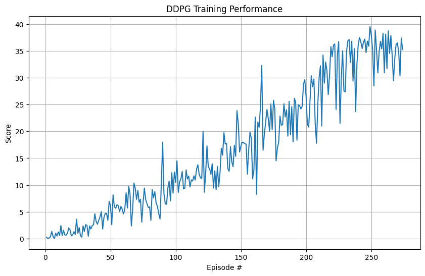

# 📄 Report.md – Continuous Control (Udacity DRL Nanodegree)

## 📌 1. Project Overview

This project uses **Deep Deterministic Policy Gradient (DDPG)** to solve the Unity Reacher environment. The objective is to train a robotic arm to control its hand and keep it within a moving target area in a continuous control space.

🎯 **Goal:** Achieve an average score of **+30 over 100 consecutive episodes**.

✅ **Reward:** The agent receives **+0.1** for every timestep its hand remains within the target zone.

⏱️ **Episode End:** The episode ends after 1000 timesteps or earlier if the simulation ends.

❌ **No penalties** are applied; the agent simply stops receiving rewards when it misses the target.

---

## 🧠 2. Learning Algorithm: Deep Deterministic Policy Gradient (DDPG)

### 🔧 Key Features
- Actor-Critic architecture  
- Experience Replay Buffer  
- Target networks with soft updates  
- Ornstein-Uhlenbeck noise for exploration in continuous spaces  

### 🔢 Hyperparameters

| Parameter         | Value     |
|------------------|-----------|
| Replay Buffer     | 1e6       |
| Batch Size        | 128       |
| Gamma (γ)         | 0.99      |
| Tau (τ)           | 1e-3      |
| Actor LR          | 1e-4      |
| Critic LR         | 1e-3      |
| Weight Decay      | 0         |
| Update Every      | 20 steps  |
| Updates per Step  | 5         |
| Noise Sigma       | 0.2       |

---

## 🧩 3. Neural Network Architecture

Defined in `model.py`:

### Actor Network
- **Input:** 33-dimensional state  
- **Hidden Layers:**  
  - Linear(33 → 256) → LayerNorm → ReLU  
  - Linear(256 → 256) → LayerNorm → ReLU  
- **Output:** Linear(256 → 4) → Tanh

### Critic Network
- **Input:** 33-dimensional state + 4-dimensional action  
- **Hidden Layers:**  
  - Linear(33 → 256) → LayerNorm → ReLU  
  - Concatenate 4-dim action → 260-dim  
  - Linear(260 → 256) → LayerNorm → ReLU  
- **Output:** Linear(256 → 1) → Q-value

---

## 📈 4. Performance

The agent successfully solved the environment:

| Episode | Average Score |
|---------|----------------|
| 100     | 4.66           |
| 150     | 10.39          |
| 200     | 17.32          |
| 250     | 26.31          |
| 274     | 30.03 ✅        |

> **Environment solved in 274 episodes!**

## 📊 5  Training Progress

---

## 📁 6. Files Included

| File                    | Description                         |
|-------------------------|-------------------------------------|
| `Continuous_Control.ipynb` | Training script and environment logic |
| `ddpg_agent.py`         | DDPG agent implementation           |
| `model.py`              | Actor and Critic network definitions |
| `checkpoint_actor.pth`  | Saved Actor weights                 |
| `checkpoint_critic.pth` | Saved Critic weights                |
| `README.md`             | Setup and execution instructions    |
| `report.md`             | This report                         |

---

## 🔭 7. Future Work

- Add support for multi-agent environments  
- Use Prioritized Experience Replay  
- Integrate Distributional Critics or Noisy Networks  
- Explore adaptive exploration methods (e.g., parameter noise)  
- Optimize network depth and activation functions  

---
