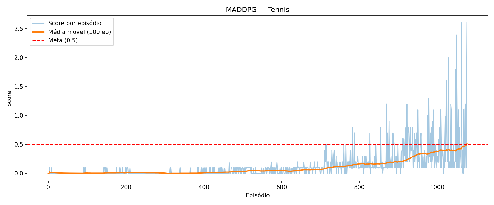

# 📄 Report – Collaboration and Competition (Udacity DRL Nanodegree)

## 📌 1. Project Overview

This project uses **Multi-Agent Deep Deterministic Policy Gradient (MADDPG)** to solve the Unity Tennis environment. The objective is to train two agents to play tennis collaboratively, keeping the ball in play for as long as possible.

🎯 **Goal:** Achieve an average score of **+0.5 over 100 consecutive episodes** (taking the maximum score between both agents).

✅ **Reward:** Each agent receives **+0.1** when it hits the ball over the net.

❌ **Penalty:** Each agent receives **-0.01** when it lets the ball hit the ground or hits it out of bounds.

⏱️ **Episode End:** The episode can last up to 1000 timesteps or ends earlier when the ball hits the ground or goes out of bounds.

---

## 🎮 2. Environment Details

The environment is built with [Unity ML-Agents Toolkit](https://github.com/Unity-Technologies/ml-agents).

### State Space
- **Dimension:** 24 per agent
- **Information:** Position and velocity of the ball and racket

### Action Space
- **Dimension:** 2 per agent (continuous)
- **Range:** Each action value is between -1 and 1
- **Actions:**
  - Movement toward or away from the net
  - Jumping

### Agents
- **Number of agents:** 2
- **Type:** Collaborative/Competitive

### Success Criteria
The environment is considered solved when the agents achieve an average score of **+0.5** over 100 consecutive episodes, where the episode score is the maximum score between both agents.

---

## 🧠 3. Learning Algorithm: Multi-Agent Deep Deterministic Policy Gradient (MADDPG)

### Algorithm Description

**MADDPG** (Multi-Agent DDPG) is an extension of DDPG specifically designed for multi-agent environments. It addresses the non-stationarity issue in multi-agent learning by using centralized training with decentralized execution.

### 🔧 Key Features

1. **Actor-Critic Architecture with Centralized Critic**
   - **Actor**: Each agent has its own Actor network (decentralized execution)
   - **Critic**: Each agent has its own Critic that observes all agents' states and actions (centralized training)
   - During execution, each agent only uses its own Actor with its local observations

2. **Independent Actor Networks**
   - Each of the 2 agents has its own dedicated Actor network
   - Agents learn policies independently but coordinate through the centralized critics
   - Experiences from both agents are stored in a shared replay buffer

3. **Experience Replay Buffer**
   - Stores experiences (state, action, reward, next_state, done) from both agents
   - Breaks correlation between consecutive experiences
   - Buffer size: 1,000,000

4. **Target Networks**
   - Separate target networks for both Actor and Critic
   - Soft updates with parameter τ (tau) for stability

5. **Ornstein-Uhlenbeck Noise with Decay**
   - Adds temporally correlated noise for exploration
   - **Noise scale decays** by 0.9995 each episode (minimum 0.01)
   - Reduces exploration over time as agents learn

6. **Multiple Learning Updates**
   - Performs **2 learning updates** per environment step when buffer has enough samples
   - Reduced from 4 to prevent overfitting in multi-agent scenario

7. **Gradient Clipping**
   - Clips both Actor and Critic gradients to maximum norm of 1
   - Prevents exploding gradients and stabilizes training
   - Applied after backward pass, before optimizer step

---

## 🔢 4. Hyperparameters

| Parameter              | Value     | Description |
|------------------------|-----------|-------------|
| **Replay Buffer Size** | 1e6       | Maximum number of experiences stored |
| **Batch Size**         | 256       | Number of experiences sampled per update |
| **Gamma (γ)**          | 0.99      | Discount factor for future rewards |
| **Tau (τ)**            | 1e-3      | Soft update parameter for target networks (reduced for smoother updates) |
| **Actor Learning Rate** | 1e-4     | Learning rate for Actor network |
| **Critic Learning Rate** | 3e-4    | Learning rate for Critic network |
| **Weight Decay**       | 1e-5      | L2 regularization for Critic |
| **Updates per Step**   | 2         | Number of learning updates per environment step (reduced to avoid overfitting) |
| **OU Noise μ**         | 0.0       | Mean of Ornstein-Uhlenbeck noise |
| **OU Noise θ**         | 0.15      | Rate of mean reversion |
| **OU Noise σ**         | 0.2       | Volatility parameter |
| **Noise Decay**        | 0.9995    | Multiplicative decay per episode |
| **Noise Minimum**      | 0.01      | Minimum noise scale |

---

## 🧩 5. Neural Network Architecture

Defined in `model.py`:

### MADDPG Architecture Overview

Each agent has:
- **1 Local Actor** (uses only its own observations)
- **1 Local Critic** (centralized, sees all agents' states and actions)
- **1 Target Actor** (soft-updated copy)
- **1 Target Critic** (soft-updated copy)

### Actor Network (Per Agent)

```
Input: Local State (24 dimensions)
    ↓
Linear(24 → 400) → LayerNorm → ReLU
    ↓
Linear(400 → 300) → LayerNorm → ReLU
    ↓
Linear(300 → 2) → Tanh
    ↓
Output: Action (2 dimensions, range [-1, 1])
```

**Parameters:**
- Input layer: 24 → 400
- Hidden layer: 400 → 300
- Output layer: 300 → 2
- Activation: ReLU (hidden), Tanh (output)
- Normalization: LayerNorm after each hidden layer
- **Decentralized**: Each agent has its own Actor

### MADDPG Critic Network (Per Agent - Centralized)

```
Input: All States Concatenated (24 × 2 = 48 dimensions)
    ↓
Linear(48 → 400) → LayerNorm → ReLU
    ↓
Concatenate with All Actions (2 × 2 = 4 dimensions) → 404 dimensions
    ↓
Linear(404 → 300) → ReLU
    ↓
Linear(300 → 1)
    ↓
Output: Q-value (1 dimension)
```

**Parameters:**
- Input layer: 48 (all states) → 400
- Concatenation: 400 + 4 (all actions) = 404
- Hidden layer: 404 → 300
- Output layer: 300 → 1
- Activation: ReLU (hidden layers)
- Normalization: LayerNorm on first layer
- **Centralized Training**: Critic sees all agents' information
- **Decentralized Execution**: Only Actor is used during inference

### Key Architectural Differences

**MADDPG vs DDPG:**

| Component | DDPG | MADDPG |
|-----------|------|--------|
| **Actor Input** | Own state (24) | Own state (24) |
| **Critic Input** | Own state + action (26) | **All states + actions (52)** ✨ |
| **Training** | Individual | **Centralized with global info** ✨ |
| **Execution** | Individual | **Decentralized (only Actor)** ✨ |
| **Networks per Agent** | 1 Actor + 1 Critic | **2 Actors + 2 Critics** ✨ |

The centralized critics help agents learn coordination by observing the full environment state, while decentralized actors allow independent execution.

---

## 📈 6. Performance

The MADDPG agents successfully learned to collaborate and keep the ball in play.

### Training Progress



The plot above shows the score per episode during MADDPG training. The blue bars represent individual episode scores, while the **orange line** shows the rolling average over 100 episodes. The **red dashed line** indicates the target score of 0.5.

### Key Results

✅ **Environment Solved:** Episode **1077** (average score: **0.509**)

✅ **Final Performance:** Average score of **0.5+** over 100 consecutive episodes

✅ **Best Performance:** Peak scores reached **2.5-2.6** in late training episodes

### Training Phases

The agents showed progressive improvement through distinct phases:

1. **Episodes 0-400: Initial Exploration**
   - Scores near 0.0
   - Agents learning basic ball tracking and racket control
   - High variability, mostly failed attempts

2. **Episodes 400-800: Skill Development**
   - Gradual improvement in ball contact
   - Beginning to maintain short rallies
   - Average score slowly increases from ~0.05 to ~0.1

3. **Episodes 800-1000: Acceleration Phase**
   - Rapid improvement in coordination
   - More consistent ball returns
   - Average score increases from ~0.1 to ~0.3

4. **Episodes 1000-1100: Convergence**
   - **Target achieved** at episode 1077 (average score: 0.509)
   - Average score crosses and maintains above 0.5
   - Consistent performance with occasional excellent rallies (2.0+ points)

5. **Post-Solving Stability**
   - Performance stabilizes around 0.5 average
   - Peak performances demonstrate mastery (up to 2.6 points)
   - High variability typical of multi-agent environments

---

## 📁 7. Files Included

| File                            | Description                                    |
|---------------------------------|------------------------------------------------|
| `Tennis_03.ipynb`               | **MADDPG training notebook**                   |
| `maddpg_agent.py`               | **MADDPG agent implementation**                |
| `model.py`                      | Actor and Critic network architectures         |
| `checkpoint_maddpg_actor_0.pth` | **Saved MADDPG Actor weights (Agent 0)**       |
| `checkpoint_maddpg_actor_1.pth` | **Saved MADDPG Actor weights (Agent 1)**       |
| `checkpoint_maddpg_critic_0.pth`| **Saved MADDPG Critic weights (Agent 0)**      |
| `checkpoint_maddpg_critic_1.pth`| **Saved MADDPG Critic weights (Agent 1)**      |
| `rewards_plot_maddpg.png`       | **Training progress visualization**            |
| `requirements.txt`              | Python dependencies                            |
| `README.md`                     | Setup and execution instructions               |
| `Report.md`                     | This report                                    |

---

## 🔭 8. Ideas for Future Work

Several improvements could enhance the agents' performance and learning efficiency:

### 1. Prioritized Experience Replay (PER)
- **Description:** Sample important experiences more frequently based on their TD-error
- **Benefit:** More efficient learning from rare but important experiences
- **Implementation:** Add priority weights to the replay buffer

### 2. ~~Multi-Agent Actor-Critic (MADDPG)~~ ✅ **IMPLEMENTED**
- **Status:** This approach was successfully implemented in `Tennis_03.ipynb`
- **Result:** Solved the environment at episode 1077 (average score: 0.509)
- **Key improvements over basic DDPG:**
  - Centralized critics with access to all agents' information
  - Independent actors for decentralized execution
  - Noise decay for better exploration-exploitation balance

### 3. Parameter Space Noise
- **Description:** Add noise to network parameters instead of action space
- **Benefit:** More consistent exploration than action-space noise
- **Implementation:** Replace Ornstein-Uhlenbeck noise with parameter noise

### 4. Twin Delayed DDPG (TD3)
- **Description:** Addresses overestimation bias in actor-critic methods
- **Features:**
  - Two critic networks (take minimum to reduce overestimation)
  - Delayed policy updates
  - Target policy smoothing
- **Benefit:** More stable and robust learning

### 5. Soft Actor-Critic (SAC)
- **Description:** Off-policy algorithm that optimizes a stochastic policy while maximizing entropy
- **Benefit:** Better exploration and more robust to hyperparameters
- **Implementation:** Replace deterministic policy with stochastic policy

### 6. Curriculum Learning
- **Description:** Start with easier tasks and gradually increase difficulty
- **Benefit:** Faster initial learning and better final performance
- **Implementation:** Vary ball speed, court size, or other environment parameters over time

### 7. Reward Shaping
- **Description:** Add intermediate rewards to guide learning
- **Examples:**
  - Reward for keeping racket close to ball
  - Reward for hitting ball toward opponent's side
- **Benefit:** Speeds up learning by providing more frequent feedback

### 8. Hyperparameter Optimization
- **Tools:** Optuna, Ray Tune, or similar
- **Parameters to optimize:**
  - Learning rates
  - Network sizes
  - Batch size
  - Update frequency
  - Noise parameters
- **Benefit:** Find optimal hyperparameters automatically

### 9. Self-Play
- **Description:** Train agents against previous versions of themselves
- **Benefit:** Continuous improvement and robustness to different strategies
- **Implementation:** Periodically save agent weights and use them as opponents

### 10. Transfer Learning
- **Description:** Pre-train on simpler tasks or use pre-trained features
- **Benefit:** Faster learning and better generalization
- **Implementation:** Start with weights from a related task

---

## 📚 9. References

1. Lillicrap, T. P., et al. (2015). [Continuous control with deep reinforcement learning](https://arxiv.org/abs/1509.02971). arXiv:1509.02971.

2. Lowe, R., et al. (2017). [Multi-Agent Actor-Critic for Mixed Cooperative-Competitive Environments](https://arxiv.org/abs/1706.02275). arXiv:1706.02275.

3. Fujimoto, S., et al. (2018). [Addressing Function Approximation Error in Actor-Critic Methods](https://arxiv.org/abs/1802.09477). arXiv:1802.09477.

4. Haarnoja, T., et al. (2018). [Soft Actor-Critic: Off-Policy Maximum Entropy Deep Reinforcement Learning with a Stochastic Actor](https://arxiv.org/abs/1801.01290). arXiv:1801.01290.

5. Unity ML-Agents Toolkit. [https://github.com/Unity-Technologies/ml-agents](https://github.com/Unity-Technologies/ml-agents)

---

## 🎓 Conclusion

This project successfully demonstrates the application of **Multi-Agent DDPG (MADDPG)** to a collaborative/competitive environment. The agents learned to coordinate their actions to keep the ball in play, achieving the target performance of **+0.5 average score over 100 episodes at Episode 1077 (average score: 0.509)**.

### Key Successes:
- ✅ Successful implementation of MADDPG with centralized training and decentralized execution
- ✅ Independent Actor networks per agent for policy execution
- ✅ Centralized Critics with access to all agents' information for stable learning
- ✅ Noise decay mechanism improved exploration over time
- ✅ Achieved target performance criteria (**solved at episode 1077 with average score 0.509**)
- ✅ Stable training with optimized hyperparameters (τ=1e-3, 2 updates/step)
- ✅ Peak performance of 2.5-2.6 demonstrates excellent coordination

### Improvements Over Basic DDPG:
The MADDPG implementation (`Tennis_03.ipynb`) showed superior performance compared to earlier DDPG variants:
- **Centralized critics** handle non-stationarity in multi-agent environments
- **Noise decay** balances exploration and exploitation automatically
- **Reduced update frequency** (2 vs 4) prevents overfitting
- **Lower tau** (1e-3 vs 1e-2) ensures smoother target network updates

The project highlights the challenges and opportunities in multi-agent reinforcement learning, where agents must learn to cooperate while adapting to each other's changing strategies. The MADDPG framework effectively addresses these challenges through its centralized training, decentralized execution paradigm.
